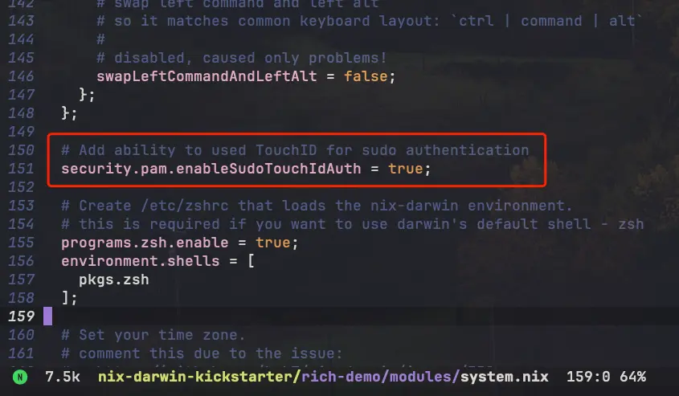
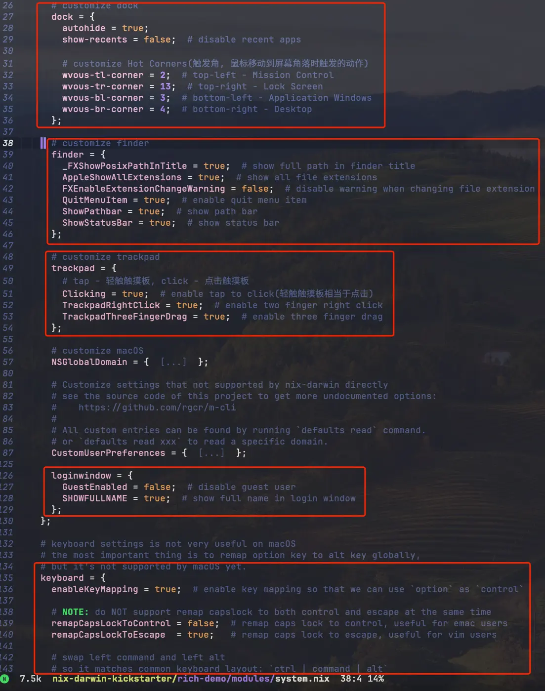

# Nix Darwin Kickstarter

A beginner-friendly nix-darwin + home-manager + flakes startup configuration.

The primary objective of this repository is to assist beginners in comprehending the fundamental setup of nix-darwin, enabling them to swiftly initiate their own nix-darwin configuration.

Two template versions are available:

- [minimal](./minimal): A basic configuration comprising essential settings for initiating nix-darwin. It can be safely deployed to your system.
- [rich-demo](./rich-demo): An extensive demo featuring a plethora of configurations that can serve as a reference for your setup. However, exercise caution, as it may **OVERWRITE** your system configuration. **DO NOT** deploy it directly to your system.

## Why nix-darwin

Nix-darwin facilitates the management of your macOS system configuration and dotfiles in a declarative manner.
You can effortlessly revert to any previous configuration, making it a robust tool for system customization.
Sharing configurations becomes seamless, and managing multiple macOS hosts is a breeze with nix-darwin.

## Showcases

Enable TouchID for sudo with just one line:

Customize (Almost) all your macOS settings via nix-darwin:

## References

- [LnL7/nix-darwin](https://github.com/LnL7/nix-darwin)
- [macos-defaults](https://github.com/yannbertrand/macos-defaults)
- [ryan4yin/nix-config/modules/darwin](https://github.com/ryan4yin/nix-config/tree/main/modules/darwin)

